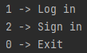

# MoneyTracker

## A console based money tracking application with a couple of functionalities:

- ### Account system:
    - logging and signing in (username and password based)
    - showing account information
    - changing information
    - logging out
    - deleting account
- ### Balance system:
    - show balance
    - add/remove money ( even from another available currency )
    - setting and changing the currency (with or without converting to it)
    - adding another currency or removing an existing one
- ### Set milestones:
    - the milestones have:
        - a name
        - an amount to reach the milestone
        - a description (can be left empty and will be set to "No description")
        - an automatically assigned creation date
    - they can be completed, taking the amount corresponding to them from the balance and adding them to "completed
      milestones"(this will assign them a completion date as well)
    - they can be removed, doing nothing but removing them from the milestone list
    - until they are removed or completed, the remaining amount until completion will be displayed next to their price
    - when the user is able to complete a milestone, he will be receiving a notification letting him know that he can
      complete that milestone, as well as displaying "(Acquired!)" next to the amount of the milestone until it's
      completed
- ### Make reservations:
    - They work similar to the milestones, except:
        - the amount you set for them represents instead how much you want to reserve from your balance, that being
          said, it is taken from your balance when making the reservation
        - when you complete them, they're corresponding amount is not taken from the balance
        - when you remove them, their corresponding amount is added back to the balance

## Log interface:

## User interface:

